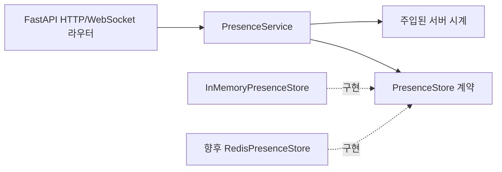

# 객체지향 설계와 변경 경계

기준일: 2026-09-09. 유지보수와 기능 추가를 위한 설계 기준이다. 프론트엔드 TypeScript + React + Vite, 백엔드 Python + FastAPI를 유지한다.

## 1. 적용 방향

객체지향은 책임·상태·외부 의존성을 분리하는 데 사용한다. 관리할 상태나 자원이 있는 엔진·클라이언트·서비스는 객체로 묶고, 좌표 변환·밤 판정처럼 입력만으로 결과가 결정되는 계산은 순수 함수로 둔다.

React 화면은 함수 컴포넌트와 Hook으로 작성한다. 엔진 어댑터를 클래스로 구현할 수 있지만 이를 이유로 화면을 클래스 컴포넌트로 바꾸지 않는다. React 공식 문서도 새 코드에 함수 컴포넌트를 권장한다. [React 문서](https://react.dev/reference/react/Component)

판단 기준은 클래스 개수가 아니라 ‘한 요구사항 변경이 관련된 작은 범위에 머무는가’다.

## 2. 핵심 원칙과 이 프로젝트의 적용

| 원칙              | 적용                                                                                       |
| ----------------- | ------------------------------------------------------------------------------------------ |
| 책임 분리         | 방문 세션, presence, 지도 표시, 검색, 밤 판정, 하늘 렌더링, 기상 조회를 각각 분리          |
| 캡슐화            | SDK 객체·HTTP 클라이언트·단위 변환·리스너를 어댑터 안에 보관                               |
| 인터페이스에 의존 | 화면·서비스는 필요한 동작의 계약을 사용하고 특정 공급자에 직접 의존하지 않음               |
| 합성 우선         | 기상 서비스에 제공자·시계를 전달하고 캐시가 필요하면 별도 구성요소로 연결                  |
| 작은 계약         | 지도 조작과 검색을 분리하고 모든 기능을 하나의 거대한 인터페이스에 넣지 않음               |
| 교체 가능한 구현  | 실제 제공자와 fake 구현이 같은 결과·오류·단위 규약을 지킴                                  |
| 단일 상태 소유자  | 정확한 관측 위치는 웹 상태가, 활성 근사 위치는 PresenceStore가, SDK 리소스는 어댑터가 소유 |

모든 함수에 인터페이스나 클래스를 만들지는 않는다. 외부 시스템·시간·수명주기처럼 교체 또는 테스트 격리가 필요한 경계부터 도입한다. 초기에는 DB Repository·Unit of Work·범용 BaseService 등을 추가하지 않는다. TTL 상태의 저장 전략을 교체할 필요가 있는 presence에만 작은 PresenceStore 계약을 둔다.

## 3. 프론트엔드 역할

| 구성요소                   | 책임                                                        | 설계 형태                                   |
| -------------------------- | ----------------------------------------------------------- | ------------------------------------------- |
| WorldMapPage·SkyViewerPage | 정보 표시와 사용자 이벤트                                   | 함수 컴포넌트                               |
| 닉네임 세션 Hook           | 입력 검증·sessionStorage 복구·서버 세션 연결                | Hook과 API 클라이언트                       |
| PresenceClient             | WebSocket 스냅샷·이벤트·heartbeat·재연결                    | 수명주기를 소유하는 클래스 또는 외부 저장소 |
| 위치·관측 흐름 Hook        | 검색 후 탐색, 최종 클릭 확정, 진입·종료 순서                | Hook과 reducer, 필요할 때 작은 조정 모듈    |
| MapController              | 지도 이동·줌·선택 이벤트·밤 색 레이어 계약                  | TypeScript interface                        |
| 지도 SDK 어댑터            | 선택한 지도 제공자 SDK 연결·정리                            | 자원을 소유하는 클래스                      |
| PlaceSearchProvider        | 검색어에 대한 정규화된 후보 반환                            | interface와 제공자별 구현                   |
| SkyEngine                  | 관측 위치·현재 시각·시선·별자리·수명주기 계약               | 기존 앱 인터페이스                          |
| StellariumAdapter          | JS/WASM·rad/MJD 변환·canvas·리스너 관리                     | 클래스                                      |
| 현재 시계                  | 현재 UTC 읽기                                               | 주입 가능한 작은 함수 또는 Clock 계약       |
| 밤 정책·좌표 계산          | 주입된 고도 기준 판정·경도 정규화·presence 격자화·단위 변환 | 순수 함수                                   |
| 기상 화면 모델 변환        | 기상 데이터의 신선도·표시 상태 계산                         | 순수 함수                                   |

MapController는 지도 조작의 역할 계약이며 MapViewport는 지도 중심·줌 데이터다. 동작 계약과 데이터 이름을 구분한다.

컴포넌트가 Google SDK 객체나 Stellarium 전역 객체를 직접 읽고 수정하지 않게 한다. 조립 지점에서 실제 어댑터를 만들고 Hook에 넘긴다. 단, SDK가 제공하는 모든 기능을 미리 추상화하지 않고 현재 필요한 계약만 만든다.

관측 위치는 명시적 최종 지도 선택에서만 바뀐다. 지도 이동·검색 결과·기상 제공자의 격자 좌표가 이를 덮어쓰지 않는다. 환경 설정의 밤 기준과 현재 시각 전용 정책도 하나의 규칙으로 유지하며 UI별로 중복 작성하지 않는다. PresenceClient에는 정확한 위치 대신 변환한 셀 중심만 전달한다.

## 4. Python 백엔드 역할

라우터는 요청·응답·WebSocket 메시지와 HTTP 상태 코드를 처리하고, 서비스는 방문 세션·heartbeat·만료 흐름을 조정하며, 저장소는 활성 근사 위치의 TTL 상태를 맡는다. 기상은 별도의 WeatherService와 WeatherProvider로 추가한다.

| 구성요소              | 책임                                                            |
| --------------------- | --------------------------------------------------------------- |
| FastAPI Router        | 설정·세션 요청과 WebSocket 메시지 검증, 서비스 결과의 전송 변환 |
| AppSettings           | 환경 변수 파싱·범위 검증, 공개 설정 모델 생성                   |
| PresenceService       | 임시 세션·watching 등록·heartbeat·종료·만료 흐름                |
| PresenceStore         | 활성 근사 위치를 TTL로 저장하고 변경 이벤트를 제공하는 계약     |
| InMemoryPresenceStore | 단일 프로세스용 첫 구현, 재시작 시 상태 초기화                  |
| PublicAppConfig       | 밤 고도 기준·presence 격자 크기의 공개 설정 값                  |
| WeatherService        | 제공자 호출과 유효 시각·결과 처리 흐름                          |
| WeatherProvider       | 정규화된 기상 결과를 돌려주는 작은 계약                         |
| OpenMeteoProvider     | 외부 URL·필드·단위·시간 초과·공급자 오류 변환                   |
| WeatherSnapshot       | 운량·기준 시각·조회 시각·출처가 담긴 값                         |
| Cache 구성요소        | 필요할 때 TTL·키·저장 정책 담당                                 |
| 조립 함수             | 선택한 구현·HTTP 클라이언트·시계를 생성하고 서비스에 전달       |

Python의 Protocol로 제공자 계약을 표현할 수 있다. Protocol은 구조적 타입 계약이며 JSON 입력을 런타임에 검증하는 기능을 대신하지 않는다. 요청·응답 검증은 Pydantic에서 맡는다. [Python Protocol](https://docs.python.org/3/library/typing.html#typing.Protocol)

FastAPI Depends는 라우터에 서비스·의존성을 전달하는 경계에서 사용한다. 서비스는 FastAPI의 Request·Depends·HTTPException에 의존하지 않고 계약과 도메인 결과를 사용한다. 별도의 DI 프레임워크는 도입하지 않는다. [FastAPI 의존성 문서](https://fastapi.tiangolo.com/tutorial/dependencies/)

검색 API가 필요해지면 같은 책임 분리 방식을 적용하되 presence·기상·검색을 하나의 만능 서비스로 합치지 않는다. Pydantic 응답 모델과 내부 값이 같고 요구가 단순하면 중복 모델을 강제하지 않는다. 외부 필드가 서비스 내부로 새어 들어올 때 별도 모델로 분리한다.

## 5. 상태와 자원 수명주기

- 웹의 클릭 위치·선택 ID는 기존 reducer가 소유한다. 클래스 내부에 별도의 권위 있는 위치 사본을 만들지 않는다.
- sessionStorage에는 닉네임과 클라이언트 세션 ID만 보관한다. PresenceClient는 밤하늘 화면의 mount·visibility·unmount에 따라 heartbeat를 시작하고 멈춘다.
- StellariumAdapter와 지도 어댑터는 자신이 등록한 이벤트·canvas·루프를 해제한다. 초기화 중 화면 이탈과 반복 정리를 처리한다.
- 서버의 공유 HTTP 연결과 PresenceStore는 앱 시작/종료에서 생성·정리한다. 요청마다 불필요하게 연결 풀이나 저장소를 만들지 않는다.
- 정확한 사용자 위치는 공유 서비스에 저장하지 않는다. PresenceStore의 변경 가능한 활성 상태는 participantId별 근사 셀·닉네임·서버 last-seen으로 제한한다.
- 캐시와 호출 제한은 범위를 명시한다. 프로세스 내부 캐시·카운터를 여러 서버 전체의 제한이라고 간주하지 않는다.
- 순수 계산에서 전역 시계·네트워크를 읽지 않는다. 현재 UTC는 호출자가 전달한다. 테스트용 고정 시계는 제품 시간 조작 UI로 노출하지 않는다.

## 6. 기능 추가·교체 예시

| 변경                    | 주로 바뀌는 영역                  | 함께 확인할 것                                    |
| ----------------------- | --------------------------------- | ------------------------------------------------- |
| 기상 제공자 교체        | 새 WeatherProvider와 조립 설정    | 단위·유효 시각·누락·오류·출처·사용 조건           |
| 지도 제공자 교체        | 지도·검색 어댑터와 조립 설정      | 제스처·검색 범위·밤 음영·출처·비용                |
| 별자리 한글 설명 추가   | 별자리 정보 조회·표시 모듈        | ID 매핑·번역·폰트, 엔진 시간과 분리               |
| 기상 캐시 추가          | 캐시 구성요소·서비스 조립         | TTL·좌표 키·응답 시각·서버 수                     |
| 구름 표현 방식 변경     | 구름 렌더링 경계                  | 운량 의미·가림·시선/줌·모바일 성능                |
| 소셜 로그인 추가        | IdentityProvider와 방문 세션 조립 | participantId 매핑·계정 탈퇴·개인정보·닉네임 충돌 |
| presence 다중 서버 확장 | RedisPresenceStore와 pub/sub 조립 | TTL·중복 이벤트·서버 장애·재연결                  |
| 채팅 추가               | 별도 ChatService·RoomPolicy       | 지역 기준·신고/차단·도배·보관·위치 보호           |

인터페이스를 둔다고 공급자 교체가 설정 한 줄로 끝나는 것은 아니다. 공급자 차이는 어댑터와 계약 검증에 모으고, 같은 결과 계약이 유지되는 한 UI와 조회 흐름의 변경을 줄이는 것이 목표다.

## 7. 검증과 커밋 원칙

순수 밤 판정과 격자화는 경계 입력으로 검증한다. PresenceService는 fake 저장소·고정 서버 시계로 등록·heartbeat·종료·TTL 만료를 검증하고, 기상 서비스는 fake 제공자·고정 시계로 성공·지연·오류를 검증한다. 화면 E2E는 기존 사용자 흐름을 확인한다.

객체지향 구조는 해당 기능을 처음 만들 때 포함한다. 구현도 없는 상태에서 거대한 추상 계층만 만드는 커밋은 만들지 않는다. 기존 코드의 외부 동작을 그대로 두고 구조를 개선할 때만 refactor 타입을 사용한다.

예정 메시지 예:

- 초기 구현: `feat(api): 기상 조회 서비스와 제공자 연동 추가`
- 방문 세션: `feat(session): 닉네임 기반 방문 세션 추가`
- 실시간 상태: `feat(presence): 관측 중 상태와 지도 핀 연결`
- 초기 엔진 연결: `feat(sky): 선택 위치의 현재 밤하늘 연결`
- 기존 구조 개선: `refactor(weather): 기상 제공자 의존성을 서비스에서 분리`
- 이번 설계 문서: `docs(architecture): 객체지향 원칙과 모듈 책임 정리`

문서상의 클래스·인터페이스명은 설계 후보이며 실제 엔진 API 명칭이나 구현 완료를 뜻하지 않는다. 상세 구현 시 현재 요구사항으로 필요한 범위를 확인한다.

## 8. 저장소 내 배치

최상위 폴더는 docs·backend·frontend로 구분한다. 객체지향의 책임 분리는 각 앱 내부에서 적용한다. 프론트엔드는 frontend/src/features 아래에 기능별 UI·계약·어댑터를 함께 두고, 백엔드는 backend/app/presence와 backend/app/weather처럼 기능 안에서 라우터·서비스·저장소 또는 제공자를 구분한다. 전체 코드에서 사용하는 거대한 classes 폴더나 공통 부모 클래스는 만들지 않는다.

화면과 API는 HTTP·JSON 계약으로 연결한다. Python 클래스를 프론트엔드와 직접 공유하지 않는다. 자세한 경로·의존성·실험 및 계약 파일 위치는 [저장소 구조](./development-guide.md#3-저장소-구조)를 따른다.
