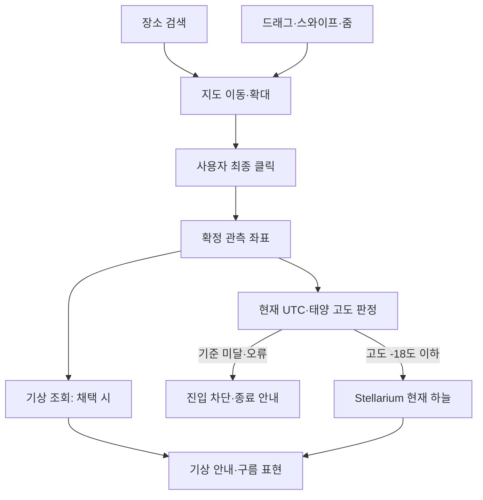

# 기술 설계서

현재는 기획 단계다. 아래는 향후 구현할 책임과 검증 항목이며 실행 검증 결과가 아니다.

## 1. 제안 기술 구성

| 영역 | 제안 | 책임 |
|---|---|---|
| 앱 | React + TypeScript + Vite | 화면·선택 위치·오류 상태 |
| 백엔드 | Python + FastAPI, 필요할 때 도입 | 기상/검색 중계·비밀 키·공통 캐시·호출 제한 |
| API 계약 | Pydantic + OpenAPI | 언어와 독립적인 HTTP·JSON 요청/응답 |
| API 개발 도구 | uv·Ruff·pytest | Python 의존성 고정·린트·테스트 |
| 하늘 | Stellarium Web Engine | 현재 UTC·위치·시선 기반 천문 렌더링 |
| 지도·검색 우선 후보 | Google Maps JavaScript API + Places의 새 검색 기능 | 일반 지도 조작·장소 검색·결과 이동 |
| 지도 대안 | Leaflet + 호환 타일·검색 제공자 | 동일 UX, 검색 범위·이용 조건 별도 검증 |
| 태양 고도 | SunCalc 1.9.0 기준 검증 | 기하 고도 rad → deg, -18° 밤 판정 |
| 기상 검토 후보 | Open-Meteo | 운량·날씨 상태·기상 기준 시각 |
| 상태 | React Context + reducer | 탐색 후보와 확정 관측 위치 분리 |
| 배포 | 정적 앱 + 필요 시 소규모 프록시 | 비밀 키·공용 제한·캐시 필요에 따라 결정 |

Google Maps와 같은 조작 경험은 확정 요구사항이다. 실제 공급자·계정·비용은 아직 확정하지 않는다. Google 지도와 Places 조합은 공식적으로 검색 결과의 지도 이동·확대와 클릭 좌표 수신을 제공한다. [검색 위젯](https://developers.google.com/maps/documentation/javascript/place-autocomplete-new), [클릭 좌표 예제](https://developers.google.com/maps/documentation/javascript/examples/event-click-latlng)

## 2. 구조와 상태 경계

검색 결과 좌표는 지도 탐색용이다. 실제 관측자 위치는 클릭 처리에서만 갱신한다. `map-explorer`, `night-eligibility`, `sky-viewer`, `live-clock`을 분리하고 기상 채택 시 `weather`를 추가한다. 타입 계약은 [데이터 명세](./data-and-interface.md)를 따른다.

## 3. 지도와 위치 확정

- PC 휠·드래그, 모바일 핀치·한 손가락 이동, 줌 버튼을 제공한다. 전체 화면 지도 영역의 제스처 옵션은 실제 기기로 확인한다. [Google 지도 조작](https://developers.google.com/maps/documentation/javascript/interaction)
- 검색 결과에 경계가 있으면 화면 맞춤, 점만 있으면 적절한 중심·줌을 적용한다. 검색 위치 편향과 지역 제한을 구분하고 전 세계 검색을 현재 화면 안으로 강제 제한하지 않는다.
- 검색만으로 엔진·기상을 갱신하지 않는다. 새 검색 결과 선택 시 이전 확정 위치를 해제한다.
- 지도 클릭/tap만 확정하며, 키보드는 지도 중심의 명시적 `이 지점 선택`을 동등한 동작으로 제공한다.
- 드래그 끝·핀치·더블클릭 확대·검색 목록·지도 버튼 입력이 단일 클릭으로 처리되지 않아야 한다.
- 확정 좌표는 WGS84 도 단위, 유한성·범위 검사 후 경도를 [-180, 180)로 정규화한다. 제공자별 lat/lng와 GeoJSON lng/lat 순서를 변환 경계에서 구분한다.
- 일반 Web Mercator 지도는 위도 약 ±85.0511°를 넘는 극점 표현에 한계가 있다. MVP는 지도에서 선택 가능한 범위를 지원하며 직접 좌표 입력으로 확장하지 않는다.
- 클릭 위치 이름과 IANA 시간대는 별도 조회값이다. 검색 결과의 이름·시간대를 주변 클릭 지점에 무조건 상속하지 않는다. 미확인 이름은 좌표, 시간대는 UTC를 표시한다.
- 검색 응답은 요청 순서로 관리한다. 오래된 결과가 뒤늦게 현재 지도나 선택을 바꾸지 않게 한다.
- 지도 배경 로드 실패 시 새 선택은 차단하고 재시도한다. 검색 실패 시에는 지도 조작을 유지한다.

## 4. 단일 밤 정책

사용자가 확정한 정책: `태양 중심 기하 고도 <= -18°`일 때만 관측 가능.

| 기하 고도 h | 표시 단계 | 관측 |
|---|---|---|
| h >= 0° | 낮 | 불가 |
| -6° <= h < 0° | 시민박명 | 불가 |
| -12° <= h < -6° | 항해박명 | 불가 |
| -18° < h < -12° | 천문박명 | 불가 |
| h <= -18° | 천문학적 밤 | 가능 |

등호는 제품 규약이다. 밤 기준은 일몰이나 날씨 제공자의 is_day와 다르다. 실제 일출·일몰은 태양 크기·굴절도 포함한다. [USNO 정의](https://aa.usno.navy.mil/faq/RST_defs)

SunCalc 1.9.0 고도는 rad이므로 180/π를 곱한다. v2 계열은 단위·굴절 규약이 다르므로 버전을 교체할 때 기하 고도 기준과의 일치를 재검증한다. 단위 변환만 바꿔 같은 결과라고 가정하지 않는다. [1.9.0](https://github.com/mourner/suncalc/tree/v1.9.0), [현재 문서](https://github.com/mourner/suncalc)

지도에는 -18° 조건에 맞는 관측 가능 영역을 표시하도록 설계한다. 일반 일몰 terminator를 관측 가능 경계로 재사용하지 않는다. 태양 위치와 등고선 기반 오버레이 또는 검증된 지리 계산이 필요하다. Leaflet.Terminator는 대안 후보일 뿐 -18° 기능 지원을 전제하지 않는다. 극지·날짜변경선·지도 반복을 검증하고 최종 진입은 항상 클릭 좌표의 직접 계산으로 결정한다.

지도는 최대 60초마다, 클릭·진입·엔진 준비 완료·탭 복귀에는 즉시 재계산한다. 하늘은 매초 판정하며 기준 미달이나 계산 오류 시 하늘을 가리고 중단한다. 로딩 중 기준을 넘은 경우도 첫 프레임 전에 차단한다.

## 5. 현재 시각만 사용

앱이 매 렌더 갱신 시 현재 시스템 UTC를 평가해 엔진에 전달하는 안을 채택한다. 엔진 자체 시간 진행은 0으로 두어 중복 증가를 막는다. 내부 속도 0은 사용자에게 정지 기능을 제공한다는 뜻이 아니다.

- 사용자 시간 상태에는 배속·정지·임의 UTC가 없다.
- 현재 시각 표시는 초당 1회, 엔진 시각은 렌더링과 맞춰 갱신한다.
- 탭을 숨기면 렌더링과 불필요한 기상 조회를 줄인다. 복귀 시 현재 UTC와 밤 조건을 먼저 확인하고 그 뒤 화면을 표시한다.
- 시스템 시각 변경 시 즉시 재동기화·밤 판정한다. 서버 없이 기기의 잘못된 시계까지 교정한다고 약속하지 않는다.
- 테스트에서 고정 시간을 주입하는 것은 향후 검증 장치이며 사용자 시간 조작 기능이 아니다.

## 6. 엔진·데이터 연결

| 앱 값 | 엔진 연결 후보 | 변환 |
|---|---|---|
| 위도·경도 deg | core.observer.latitude / longitude | deg × π / 180 |
| 고도 m | core.observer.elevation | MVP 0m; 실제 지형 높이 아님 |
| 현재 UTC epoch ms | core.observer.utc | ms / 86400000 + 40587, UTC MJD |
| FOV deg | core.fov | deg → rad |
| 앱 단일 시계 | core.time_speed | 0, 앱이 현재 UTC 전달 |

이 매핑은 소스 확인을 바탕으로 하며 실제 JS 바인딩·갱신 순서는 향후 고정 커밋으로 검증한다. [관측자](https://github.com/Stellarium/stellarium-web-engine/blob/master/src/observer.c), [코어](https://github.com/Stellarium/stellarium-web-engine/blob/master/src/core.c), [시간 진행](https://github.com/Stellarium/stellarium-web-engine/blob/master/src/navigation.c)

초기화 후 별·서양 sky culture·폰트 등 필수 자산을 별도로 준비한다. JS/WASM 초기화와 필수 데이터 준비를 구분한다. 예제 CDN 주소를 운영 이용 허가나 가용성 보장으로 가정하지 않는다. [공식 예제](https://github.com/Stellarium/stellarium-web-engine/blob/master/apps/simple-html/stellarium-web-engine.html)

자산 경로·커밋·데이터 버전·재배포 조건, WASM MIME, CORS, 압축·캐시, 하위 경로·CSP를 향후 검증한다.

## 7. 시선·별자리·기상

초기 시선은 북쪽 0°·고도 45°·FOV 70°다. 지평선 기준으로 고정하고 천체 자동 추적을 해제한다. 엔진의 방위각 규약과 앱의 북쪽부터 시계방향 규약을 맞춘다. 하늘 조작 FOV는 20~120°로 제한한다.

기본 별자리 연결선과 이름은 엔진 데이터를 사용한다. 한글·picking·선 강조는 후속 검증 대상이다. [별자리 소스](https://github.com/Stellarium/stellarium-web-engine/blob/master/src/modules/constellations.c)

기상은 엔진 내장 실황 기능으로 가정하지 않고 별도 조회·정규화·합성 책임을 둔다. 운량 비율과 불투명도를 구분하고 구름의 시선·줌 대응과 별자리 가림을 검증한다. 자세한 제안은 [기상 반영](./weather-integration.md)을 따른다.

## 8. 수명주기·운영

초기화 중 이탈과 재진입, React Strict Mode, listener·canvas·루프 중복을 관리한다. 완전 해제가 어려우면 앱 수명 동안 한 엔진을 유지하되 불허·숨김 상태에서 표시와 렌더링을 멈추는 방식을 검토한다.

Google Maps/Places 선택 시 결제 계정·API 키·호출 과금과 제한 설정이 필요하다. 브라우저용 지도 키는 출처·API 제한을 설정하고 서버용 비밀 키와 구분한다. [Google 사용·과금 안내](https://developers.google.com/maps/documentation/javascript/usage-and-billing)

기상·검색 제공자의 비밀 키와 전체 요청 제한이 필요하면 프록시를 추가한다. 현재는 제공자 계약이나 배포를 진행하지 않는다.

## 9. 지도 밝기장의 최종 규약

현재 UTC와 태양 위치로 각 지리 좌표의 기하 고도를 계산한다. 낮·박명의 연속 밝기 효과는 h > -18° 범위에만 적용하고, h <= -18°이면 **하나의 nightTint와 nightOpacity로 고정**한다. 태양 고도가 더 낮아져도 밤 상태 레이어는 변하지 않는다.

빛 중심은 태양 직하점에 대응하는 지리 위치를 기준으로 하며 현재 태양 위치·계절·투영에 따라 모양이 달라질 수 있다. 한국 정오 부근에는 한국을 포함한 낮 영역이 넓게 밝게 보이는 효과를 목표로 한다. 화면 좌표에 고정한 원형 그라데이션을 지도와 무관하게 붙이지 않는다.

관측 가능 영역에는 운량·달빛·광공해에 따른 추가 지도 음영을 적용하지 않는다. 바탕지도와 상태색 레이어를 분리하고, 지명·도로 가독성을 위해 밤 음영 상한을 둔다. 단일 색은 상태 레이어의 규약이며 실제 타일의 지형색까지 동일하게 만든다는 뜻은 아니다.

지도 음영, -18° 경계, 카드 계산에는 같은 태양 모델과 UTC 스냅샷을 사용한다. 지도 렌더링은 보간해도 클릭 판정은 원본 좌표에서 직접 계산한다. 해상도·LOD·날짜변경선 처리와 화면 갱신 비용은 향후 검증한다.

## 10. 하늘 배경의 밝기

대기 효과를 기본 켜고 유지한다. 확인한 공식 소스에서는 태양·달 위치와 밝기, 대기·광공해 설정이 렌더링에 쓰인다. 실제 기상 조회·현지 광공해 자동 반영과 구분한다. [공식 대기 소스](https://github.com/Stellarium/stellarium-web-engine/blob/master/src/modules/atmosphere.c)

제품 진입은 -18° 이하로 제한하므로 밝은 박명 화면은 제공하지 않는다. 그렇더라도 모든 밤을 동일 RGB로 보정하지 않고 엔진의 자연스러운 밝기 차이를 유지한다. 기본 검정 CSS 배경은 로딩 배경일 수 있으나 최종 하늘 색을 규정하지 않는다.

## 11. 언어와 개발 순서 확정

2026-09-08 사용자 선택으로 백엔드는 Python + FastAPI를 사용한다. 프론트엔드는 TypeScript + React + Vite를 유지한다. Node.js는 웹 개발 도구용이며 API 서버의 언어 선택과 구분한다. 서버 도입 시점은 외부 API 운영 요구에 따라 정하고 초기 DB는 추가하지 않는다.

웹과 API의 공통 타입을 TypeScript 패키지로 강제하지 않는다. FastAPI 모델에서 내보낸 OpenAPI 명세와 계약 검증으로 연결한다. 웹/API 의존성은 npm과 uv로 따로 관리한다. [개발 가이드](./development-guide.md)

엔진 최소 검증 후 정식 화면은 메인 지도에서 밤하늘 페이지 순서로 만든다. 각 기능의 구현·검증을 하나의 목적을 가진 커밋으로 남긴다. [커밋별 구현 계획](./implementation-plan.md)

## 12. 객체지향과 의존성 방향

지도는 MapController, 검색은 PlaceSearchProvider, 하늘은 SkyEngine 계약을 두고 선택한 SDK의 구현을 어댑터 안에 격리한다. UI/Hook은 계약을 사용하고 조립 지점만 실제 구현을 선택한다. React 화면은 함수 컴포넌트이며 밤 판정·좌표·시간 변환은 순수 함수다.

백엔드는 FastAPI Router → WeatherService → WeatherProvider 계약으로 의존하고 OpenMeteoProvider는 이를 구현한다. Depends는 프레임워크 경계의 조립에 사용하고 서비스는 HTTP나 FastAPI 타입에 직접 의존하지 않는다. Python Protocol은 제공자 타입 계약, Pydantic은 입력·응답 검증에 사용한다.

공유 서비스에 사용자 위치를 저장하지 않고 요청 인자로 전달한다. 엔진·지도·HTTP 연결의 생성/해제 책임을 명시한다. DB 계층·범용 BaseService·깊은 상속은 현재 범위에 추가하지 않는다. [객체지향 설계와 변경 예시](./object-oriented-design.md)
